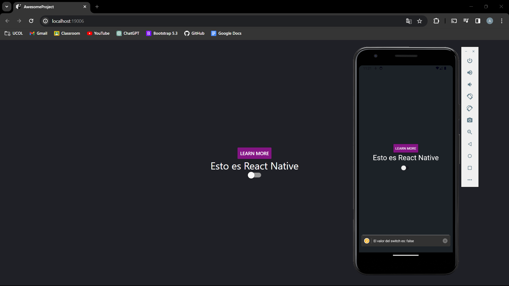
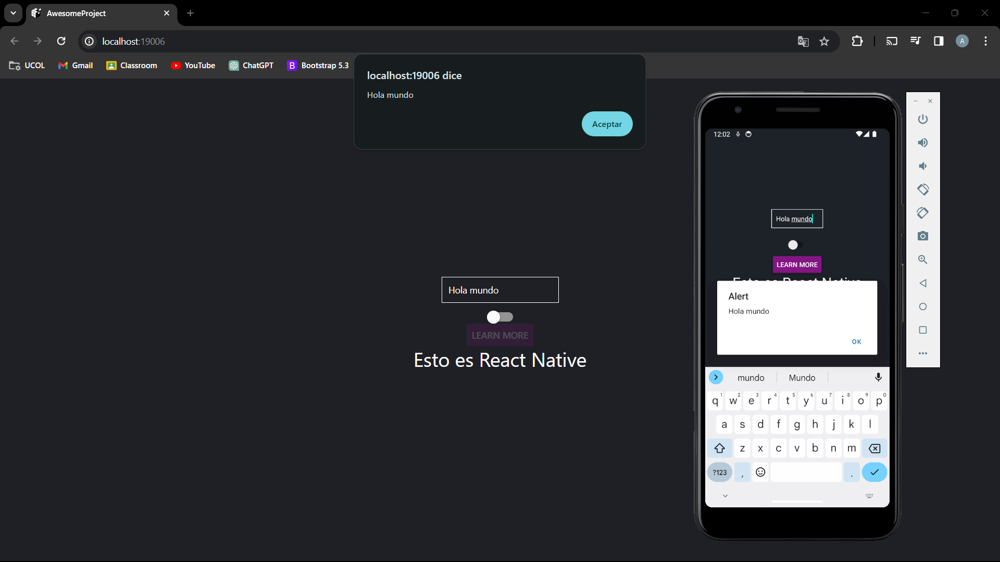

# Práctica R1 - Text Input y Alert en React Native

## Practica R1 con React Native y Expo

Este repositorio contiene la Práctica R1, en la cual se emplean React Native y Expo. Se utilizan componentes básicos de la interfaz de usuario para el desarrollo de aplicaciones móviles.

## Componentes utilizados

Para esta practica se utilizaron los siguientes componentes

- **Text**:
> Componente de React para mostrar texto -> [Ver más de **Text**](https://reactnative.dev/docs/text)

- **Button**:
> Componente interactivo para el usuario, permite desencadenar acciones -> [Ver más de **Button**](https://reactnative.dev/docs/button)

- **Switch**:
> Alternador de estado, enciende o apaga opciones -> [Ver más de **Switch**](https://reactnative.dev/docs/switch)

- **TextInput**:
> Campo interactivo que permite a los usuarios ingresar texto -> [Ver más de **TextInput**](https://reactnative.dev/docs/textinput)

## Resultado

